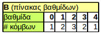
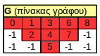
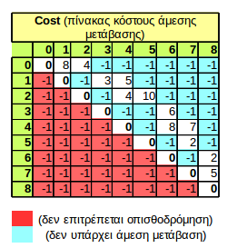
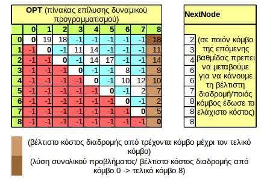

# Dynamic_Programming_Exercise_1
# ΕΥΡΕΣΗ ΒΕΛΤΙΣΤΗΣ ΔΙΑΔΡΟΜΗΣ ΣΕ ΓΡΑΦΟ

1. έστω γράφος της μορφής (παράδειγμα σημειώσεων)
	 

1. Ερώτηση στο χρήστη ή εισαγωγή από αρχείο: Πόσες βαθμίδες έχει το πρόβλημα;

	```
	numberOfVa8m;	
	B[numberOfVa8m];
	```
	
1. Ερώτηση στο χρήστη ή εισαγωγή από αρχείο: Πόσοι κόμβοι σε κάθε βαθμίδα;

	```
	numberOfNodes = 0; //συνολικός αριθμός κόμβων
	for( i = 0; i == numberOfVa8m; i++){
		//fill B[i]
		numberOfNodes++;
	}	
	```
	 
	
1. Δημιουργία πίνακα που απεικονίζει το γράφο

	βρίσκουμε μέγιστο στοιχείο του πίνακα Β και δημιουργούμε πίνακα G με διαστάσεις **(numberOfVa8m)x(max)** 
	
	```
	max = 0;
	for (i = 0; i==numberOfVa8m; i++){
		if(B[i] > max) 
	 	max = B[i]
	}
	```
	
	γεμίζουμε το πίνακα G (κατά στήλες), βάζουμε -1 στις θέσεις όπου δεν υπάρχει κόμβος και ονοματίζουμε τους κόμβους με έναν αύξοντα αριθμό
	
	```
	node = 0;
	for (i = 0; i == numberOfVa8m; i++){
	 	for(j = 0; j < max; j++){
	 		if(j<B[i]{
	 			G[j,i] = node;
	 			node++;	
	 		} else G[j,i] = -1;
	 	}
	}
	```
	 
	 
	
1. Εκτύπωση του Γράφου

	```
	printGraph(){
		for (i = 0; i < max; i++){
			for (j = 0; j == numberOfVa8m; j++){
				if(G[i,j] > -1) print G[i,j]
				else print " "
			}
			print \n
		}
	}
	```

1.  Ερώτηση - Εισαγωγή από τον χρήστη : κόστος άμεσης μετάβασης
	```
	for (i = 0; i < numberOfNodes; i++){
		for(j = 0; j <numberOfNodes; j++){
			if (i < j ) Cost[i,j] = -1; //κάτω τριγωνικός
			else if (i = j ) Cost[i,j] = 0; //διαγώνιος
			else {
				print is there a path from node i to node j ?
				fill Cost [i,j]
			}		
		}
	}
	```
	 

1. Επίλυση του προβλήματος, δημιουργία πίνακα OPT και NextNode

	κόμβος OPT[i,j] είναι το κόστος διαδρομής από τον κόμβο i στον κόμβο στόχο μέσω του κόμβου j

	στην τελευταία στήλη του πίνακα OPT αποθηκεύεται το βέλτιστο κόστος διαδρομής μέχρι τον τελικό κόμβο, δηλαδή το min της γραμμής

	στον πίνακα NextNode αποθηκεύται η τιμή του j για το οποίο βρέθηκε η min τιμή
	
	ο πίνακας OPT του δυναμικού προγραμματισμού γεμίζει από κάτω προς τα πάνω γραμμή γραμμή
	
	```
		/*
		* initialize OPT table
		* copy -1 and 0 values
		*/
		for (i = 0; i < numberOfNodes; i++){
			for (j = 0; j < numberOfNodes - 1; j++){ //exclude last column
				if (Cost[i,j] <= 0) OPT[i,j] = Cost[i,j];
			}
		}
		OPT[numberOfNodes-1, numberOfNodes-1] = 0; //στοιχείο της διαγωνίου τελευταίας στήλης
				
		for( i = numberOfNodes-1; i<0; i++){
			min = + 20000000000000000 //arbitrarily large number
			for( j = 0; j < numberOfNodes-1; j++){
				if (OPT[i,j]<=0) continue;
				else {
					OPT[i,j] = Cost[i,j] + OPT[j,numberOfNodes-1];
					if (OPT[i,j] <= min {
						OPT[i,numberOfNodes-1] = OPT[i,j];
						NextNode[i] = j;					
					}
				}
			}
		}
	```

	
	
1. Εκτύπωση Βέλτιστου Κόστους διαδρομής

	Για το συνολικό πρόβλημα: από κόμβο 0 -> τελικό κόμβο
	
	τελικός κόμβος-στόχος είναι πάντα ο κόμβος numberOfNodes-1
	```
	BestCost(startNode){
		print OPT[startNode,nunumberOfNodes-1];
	}
	```
	
1. Εύρεση μονοπατιού
	
	από όποιον κόμβο του γράφου
	
	τελικός κόμβος-στόχος είναι πάντα ο κόμβος numberOfNodes-1
	```
	BestPath(startNode){
		print startNode
		visitNextNode = nextNode[startNode];
		while(visitNextNode != numberOfNodes-1){
			print visitNextNode;
			visitNextNode =  nextNode[visitNextNode];
		}
	}
	```

